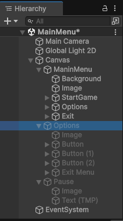
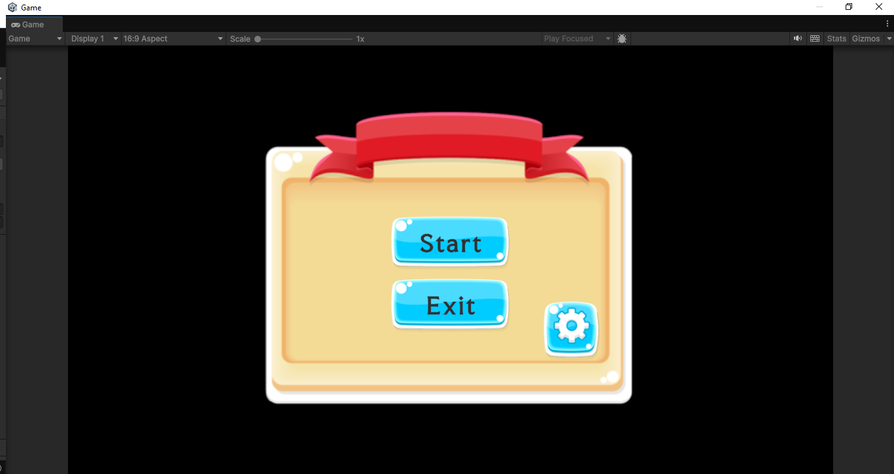
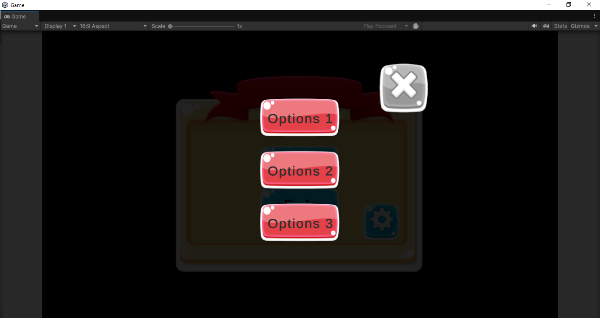
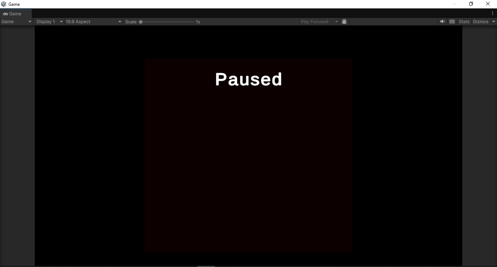

# Interface-Usuario-Menu

<h2>📌 Estrutura do Projeto</h2>

O projeto contém a seguinte hierarquia de objetos no Unity:

<h2>📷 Imagens Hierarquia</h2>
    

<h2>🛠️ Configuração do Projeto</h2>
<ol>
    <li>Abra o Unity e crie um novo projeto.</li>
    <li>Crie um <strong>Canvas</strong> para conter os elementos do menu.</li>
    <li>Adicione os botões e outros elementos conforme mostrado na imagem.</li>
    <li>Crie um GameObject chamado <strong>MainMenu</strong> e anexe o script abaixo a ele.</li>
</ol>

<h2>📜 Código do Script</h2>

O seguinte código controla o menu:

<pre>

using System.Collections;

public class MainMenu : MonoBehaviour
{
  public GameObject pauseMenu;
  private bool activeMenu;
  private void Update()
  {
    if (Input.GetKeyDown(KeyCode.Escape))
    {
        activeMenu = !activeMenu;
        pauseMenu.SetActive(activeMenu);
    }
  }

  public void StartGame()
  {
    SceneManager.LoadScene(1);
    Debug.Log("Botão ativado");
  }

  public void ExitOptionMenu(GameObject go)
  {
    go.SetActive(false);
  }

  public void ActiveOptionMenu(GameObject go)
  {
    go.SetActive(true);
  }
}

<h2>🎮 Funcionalidades</h2>
<ul>
    <li>A tecla <strong>Esc</strong> ativa e desativa o menu de pausa.</li>
    <li>O botão <strong>StartGame</strong> carrega a cena do jogo.</li>
    <li>O menu de opções pode ser ativado ou desativado.</li>
    <li>Para mudar de cena, é necessário criar uma nova cena no Unity e configurá-la no <strong>Build Settings</strong>.</li>
</ul>

<h2>📷 Imagens Adicionais</h2>

